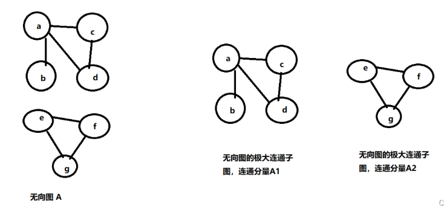

## 图

对于n个结点的图来说：

无向完全图： 有n(n - 1)/2 条边，如下：4个顶点有6条边

  
 
 
 

连通图：无向图中，任意两个顶点是连通的（一个顶点不必与另一个顶点直接相连，可以通过其它顶点到达即可）最少有n-1条边；如下：4个顶点最少需要3条边才能够连通

  
 
 
 

非连通图：即边数少于n-1条，最多有（n-1）*(n-2)/2条，如下：5个结点，非连通，最多有6条边

  
 
 
 

连通分量：无向图中（区别于有向图）的极大连通子图，极大即要求拥有连通子图的所有边，例如，如果A1中少了a-d这条边就不是极大连通子图了

  
 
 
 